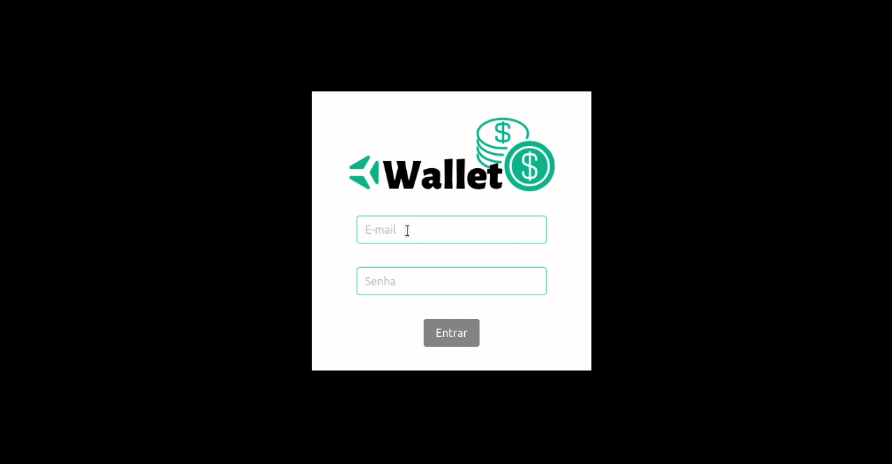

# Boas-vindas ao repositório do projeto Trybe Wallet!
Projeto desenvolvido no curso da Trybe ao final do bloco 15* do Módulo 2 - Desenvolvimento Front-end.  
<strong>*Bloco 15: Gerenciamento de estado com Redux </strong> 
 15.1 - Introdução ao Redux - O estado global da aplicação 
 15.2 - Usando o Redux no React 
 15.3 - Usando o Redux no React - Prática 
 15.4 - Usando o Redux no React - Actions Assíncronas 
 15.5 - Testes em React-Redux 
 15.6 - Projeto - Trybe Wallet 
 
 No projeto <strong>Trybe Wallet</strong> foi desenvolvida uma aplicação em React utilizando o Redux a qual é possível adicionar várias despesas em diversas moedas diferentes que serão convertidas para real. Cada despesa pode ser editada e excluida.
 
 Veja o resultado: https://nataliafranceschi.github.io/15-Project-Trybe-Wallet/
 

